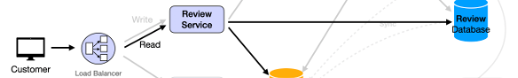

# Content
- Creating a system that allows users to apply for unemployment benefits
- Designing a review system i.e. like Yelp
    * Specifically it was Amazon Reviews

> Review
- For future system designs:
    * Start with happy path: core user journey first, Think in resources - what is being created(POST)/read(GET), Updating(PUT)

    * APIS
        - GET /benefits -> User browses available benefits
        - POST /applications -> User submits apps
        - Background processing -> Gov reviews apps ( Topics -> event store and queue)
        - GET /applications/{id} -> User checks status and gets result of specified app
        - Webhook/notis -> User notified of decision
            * AWS SNS/Gen webhook service
                - Apps service subscribes to events from event source, update own db and then push notification events to sns
            * Reliable


## Designing Amazon Review System
- Amazon review system provides rating system after post purchase -> prompt users to upload photos -> provide evaluation criteria
    * Most positive v most critical reviews
    * Vote to promote functionality for reviews

    * High Level Design: Handle review related logic
        - Review Service
            * Video reviews stored in AWS S3
        - Product Service
            * Reviews are always on products (description, payment, review)
        - User Service
            * User writes review on product and can view their user history
        - Order Service
            * User reviews product after order is placed

    * Review Service Design:
        - API:
            * PostReview (product, user, content)
                - content has ratings and comment, user can add review for specific criteria
            * GetReviews(productId)
            * Upvote(reviewId)
            * Downvote(reviewId)

    * Database:
        - Review Table
        ```
        {
            reviewId,
            productId,
            userId,
            reviewRatings,
            review_content,
            upvote, downvotes
        }
        ```
        - User Table
        - Product Table

    * Implementation: Post purchase review is triggered by order service -> for each, set timer and when it expires then set out email to user for review

    * Optimization:
        - Min review retrieval latency: Store review in cache and only display most helpful reviews and omit common reviews
        - Scaling:
            * Replication: Multiple instances for review service
            * Sharding: Shard by product type and increase response speed
        - Reliability
            * Fault tolerance: Back up review data
            * High availability: Deploy to public cloud -> create monitoring dash/alert rule


## Designing Yelp
### Description
- Design online platform that supplies geo-based search and publishes crowd-sourced reviews about businesses, products like Yelp

* Functional Reqs
    - Users should be able to search and view businesses
    - Users should be able to post a review
    - Users should get paginated reviews

    * 1m daily active users, 100:1 (read to write), 5 yr data retention, each user performs 1 write/10 days, 1kb size for reviews


* Non Functional Reqs
    - CAP: High availability, low consistency -> redundancy and failover strategies for high operation even in comp failures
    - Scaling: Horizontal to accommodate loads, spikes in user activity w/o performance degradation
    - Low Latency: low biz search

* Services/API Endpoints
- Search, Businesses, Reviews

- GET /search?lon={lon}&lat={lat}&keyword={keyword}&radius={radius}
    * search in given circular area
        ```json
        // response
        {
            'status':200,
            'business";[...]
        }
        ```
* Maybe in instance of clicking on a specific business when you get back array of bizes

- GET /businesses/{business_id}
    * retrieve info about biz
        ```
        {
            biz_id : int,
            lat : float,
            lon : float,
            name : str
        }
        ```

- POST /reviews
* request
{
    'biz_id':int,
    'rating':float,
    'content':'review content'
}
* response
{
    status: 200,
    review_id: int
}


- GET /businesses/{business_id}/reviews?page={page_number}&limit={limit}&last_timestamp={timestamp}
{
  "status": 200,
  "current_page": 1,
  "per_page": 10,
  "total_pages": 5,
  "total_reviews": 50,
 reviews: review[]
}


## Diagram
- Business Service
Biz User -> LB -> API Gateway -> Biz Service -> Message Queue (async buffer allowing other services to communicate with required dbs) -> DB Updater (consume messages) -> Biz DB

- Review Service
Customer -> LB -> API Gateway -> Review Service -> Message Queue -> DB Updater -> Biz DB and Review DB

- Search Service'
Customer -> LB -> API Gateway -> Search Service -> Cache (connected to DB Updater) and ElasticSearch connected to Biz DB
    - Includes CDC (Change Data Capture) for source data consistency
