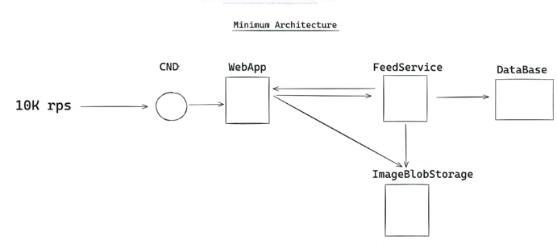
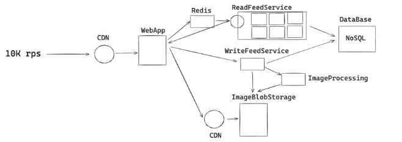
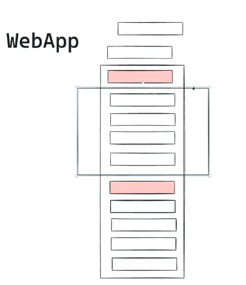

# [ Build Instagram ](https://www.youtube.com/watch?v=_HjRSHeQ92k)

### Req Analysis
- Are we focused on web site or mobile app?
    * Going to see several different posts (images), text component
    - Out of scope: buttons, likes, comments
- Users can create posts, update, delete -> 1mil daily active with 1 daily post per user compared to 100 views per user (read:write ratio is large)
    * Peaks: 1pm lunch time, 9pm evening - 70% users active
- Max load is 100 * 700k divided by (2*60*60)

### Building MVP
- Show how problem can be solved -> solution articulation

- Webapp communicates to Feed Service
- `FeedService` persists to `imageBlobStore`
- `WebApp` consumes from BlobStore and FeedService sends back url of req image to WebApp
- DB stores post metadata to be returned to client
    * 10k requests per second
    * Assumption: US, major cities for most reqs
- Added CDN prior to webapp to direct requests properly

- Added second CDN next to imageBlobStore connected to WebApp
    * Manage static assets
- Separate services being `ReadFeedService` and `WriteFeedService` -> scale RFS in order to have high level of scaling/replicas
    * ReadFeedService has LB with several various replicas for sharding and horizontal scaling
- NoSQl DB provides scalability advantage and there is no serious relational connections as each post is connected to one user
- Optimize images with Serverless Lambda (serverless event driven compute service)`ImageProcessing`
- Redis cache next to ReadFeedService as posts dont change often -> leverage for caching of most popular

- WebApp has rectangle in middle that acts as viewport
- Dom and Unmount Posts that are not viewed inside viewport
    - Div with hidden property that are still calculated in scroll
    * Virtualized list
- Fetching
    * Pagination
        - Cursor based with an intersection observer api
            * cursor = post id, then render with reference
    * Prefetch next `x` posts
* Good use case for server side rendering
    - Pre-render everything around feed not with posts being pre-rendered
