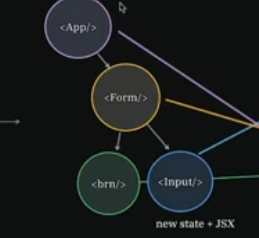

# [React Interview Questions](https://www.youtube.com/watch?v=XU6O4ASQoWs)

## 1. React Fiber vs Virtual Dom (VDOM)
- Early in React we had a React Element that created a VDOM Node that converts to DOM Node -> All had to be done in 1 shot (hard computation and rendering)
- Creating the React Fiber (intermediary structure between React Element and VDOM Node)
    - React Fiber
        * Unit of work, store updates to be applied if needed
        * Current state, Current Props

        * All work of rendering components
            - Work on this tree -> create new state -> answer to lifecycle methods
            - Render VDOM Node from Fiber tree
            - Can pause if we have priority updates -> do something else and come back to react fiber (synchronous)

    - VDOM after creation of React Fiber is used to compute differences to actual DOM

## 2. Explain React reconciliation process
- Traditional Reconciliation
    1. State Change -> trigger setState()
    2. Rerender of Component Tree
        - Go from root node to children nodes
            * 
    3. Put all these renders/re-renders into call stack then construct new VDOM (Virtual DOM)
- With Fiber,
    1. From component tree build Fiber Tree (JS object) inclusive of new state, props, functions, siblings
    2. Memoized State from fiber tree -> New VDOM
- Fiber (seems to add complexity alone as intermediary)
    * FT works together with a priority queue, scheduler -> can actually pause and start at different node then come back (async)
    * if `setState()` occurs, change will be queued -> FT will be copied in background and perform work then compute new memoized state
    * React goes to main thread in web browser, 'is browser idle?` -> then React can do some work in set interval period of 15 minutes
        - (good) reuses alot of fiber tree -> optimize as much as possible to use prior fiber tree
        - even if we are doing alot of work in background, ui feels more fluid due to work prioritization
            * react creates fiber trees for work that is of higher priority for async work like inputs for forms
    - [ Priority Hierarchy ]
        1. Discrete event: input, click
        2. User Blocking: scroll
        3. Normal Priority: data fetch
        4. Low Prio: Route Change
        5. Lowest: Pre-renders

## 3. Diffing Algo in VDOM
- Render process can be processed async, then sync commit stage
- Commit stage -> push to VDOM for final computation
    * Computing VDOM, comparisons traditionally two trees would be O(N*N) -> BILLION COMPS FOR 1000 Nodes

- Differing heuristics
    * if different type, redo
    * assume keys are stable and unique
        - if we have list, ask for key prop for leaf nodes in tree

### Further Investigation
- Browser APIs: Request E Callback, Request animation frame
