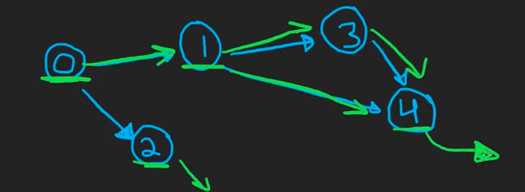

# 09/29/23

## [Course Schedule](https://www.tryexponent.com/practice/prepare/course-schedule)

### Problem
- Given #`numCourses`, list of `prerequisites` where each element in `prerequisites` -> `[a_i, b_i]` -> must take `b_i` prior to `a_i`
- Write algo `canFinish` returning `True` if possible to finish all courses, `False` otherwise
- Need to complete all courses for results to be `True`

### Analysis
- Input: number of courses `int`, pre-reqs(classes to take and deps) `list[int]`
- Output: boolean of True or False if one can complete all courses

- Algo Process
    - Restate Problem
        * given the number of courses and the deps relations between courses, determine ability for curricula completion

    - Goal of Function
        * Determine if all courses up to numCourses can be taken as desired using dep relation

    - Types
        * int, list[[list[int, ...]]]

    - Assertions and Assumptions
        * no duplicate prereqs, `numCourses` > 0

    - Edge Cases (regardless of assertions, assumptions)
        * Cycles, empty inputs, 0 for numCourses

#### Example \#1
```py
numCourses = 2
prerequisites = [[2, 1], [1, 0]]
# returns True: 0 -> 1 -> 2
```

#### Example \#2
```py
numCourses = 4
prerequisites = [[3, 2], [2, 1], [1, 0], [0, 3]]
# returns False: Prereqs form cycle -> unable to finish all courses
# 0 -> 1 -> 2 -> 3 -> 0 (continues)
```
#### Example \#3
```py
numCourses = 5
prerequisites = [[4, 2], [3, 1], [2, 0]]
# returns True: 0->2->4
```

### Notes
- Impossible scenario
    * n=2, preqs = [[1,0],[0,1]] -> cycle as courses are dep on each other
- DFS Version (go deep as much as one can per branch prior to backtracking as opposed to prioritizing width of search -> level by level)
- Feasible
    * n = 5, preqs = [[0,1],[1,2],[1,3],[1,4],[3,4]]
    * 
        - Direction of edges represents dependencies i.e 0 depends on 1 and 2 (0 points to 1 and 2)
        - Can complete all courses as a cycle isn't formed
    * Method
        - Use adj list (preMap) -> each course, has list of pre-reqs
        - Run dfs in order of O to n-1
        - if continue to dfs on deps, course can be completed then we check that (propagates upward) of previous course and pop as we understand pre-reqs can be completed
        - If we are able to complete every single course via popping and verifying checks, then we can return True

- Detecting loops
    * Use set and as we traverse add them for deps
    * if we encounter a duplication then we return False

#### Code Notes
- visitSet.remove(crs)
    * enter a node -> add to visitset after done exploring it -> remove from set i.e like a stack
    * Prevent false positives and explore other paths

- preMap[crs] = []
    * Micro optimization akin to DP memoized/topologically sorted -> avoid rechecking entire subtrees

- 
